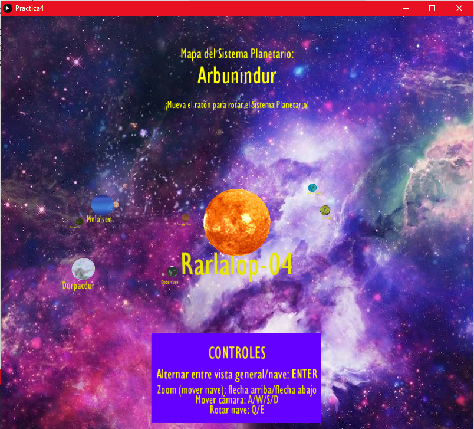

# Práctica 4 - Cámara para Sistema Planetario


## Memoria

### Autor

Kevin David Rosales Santana - <kevin.rosales101@alu.ulpgc.es>

### Índice

1. [Introducción](#1-introducción)
2. [Muestra del resultado](#2-muestra-del-resultado)
3. [Descripción del trabajo realizado](#3-descripción-del-trabajo-realizado)

   3.1 [Estructura de ficheros](#31-estructura-de-ficheros)
   
   3.2 [Decisiones en el desarrollo](#32-decisiones-en-el-desarrollo)
   
      - 3.2.1 [Cambio entre vista general/nave](#321-cambio-entre-vista-general/nave)
      - 3.2.2  [Vista de la cámara](#322-vista-de-la-cámara)
      - 3.2.3 [*Zoom* de la cámara (movimiento)](#323-zoom-de-la-cámara-(movimiento))
      - 3.2.4 [Rotación de la cámara](#324-rotación-de-la-cámara)
      - 3.2.5 [Límites en el movimiento](#325-límites-en-el-movimiento)
   
4. [Conclusión](#4-conclusión)
5. [Ejecución del Proyecto](#5-ejecución-del-proyecto)
6. [Referencias y herramientas utilizadas](#6-referencias-y-herramientas-utilizadas)

### 1. Introducción

En la presente práctica se pedía implementar **una cámara para el sistema planetario** de la [práctica anterior (ver referencia 9)](#6-referencias-y-herramientas-utilizadas) en movimiento, sirviendo para el aprendizaje de *Processing*, el cual tiene como objetivo facilitar los desarrollos con fines creativos en entornos digitales. 

Dicho **sistema planetario** debía incluir una estrella, (al menos) cinco planetas y alguna luna, integrando primitivas 3D, texto e imágenes (como por ejemplo, una imagen de fondo). En este caso se parte de un sistema planetario con:

- 1 estrella, 8 planetas y 4 lunas con rotaciones lógicas.
- Texturas e imagen de fondo. 
- Título e información de control en el menú.
- Nombre de sistema planetario, de estrella y de los planetas aleatorio.
- Cohete espacial (sin movimiento propio) apuntando a la estrella.
- Movimiento del sistema planetario con el ratón.

En este repositorio **se tiene la implementación de la cámara pedida**, que incluye:

- Posibilidad de cambiar entre **vista general** ([de la anterior práctica (ver referencia 9)](#6-referencias-y-herramientas-utilizadas)) y **cámara de la nave.**
- **Cámara en primera persona de la nave** que incluye:
  - Capacidad de **rotación.**
  - Capacidad de **realizar *zoom*** (aportando movimiento para **acercarse** o **alejarse**).
  - Capacidad de **modificar la vista de la cámara.**
- **Límites en el movimiento para evitar fallos o alejarse en exceso del sistema planetario.**
- **Nota importante:** se ha decidido que la nave (o cámara) **no pueda realizar desplazamientos horizontales o verticales simples** (es decir, sin realizar un zoom que puede ser combinado con un cambio en el objetivo gracias a la vista de la cámara) dado a que en este caso, **un cohete no debería ser capaz de realizar dichos movimientos.**

### 2. Muestra del resultado

<div align="center">
   </img>
   <p>Figura 1: Muestra del resultado</p>
</div>
**Nota importante:** los elementos que pertenecen al sistema planetario no realizan rotaciones tan rápidas como las que se pueden observar en la *Figura 1*. Esto se debe a la representación que proporciona el *.gif*.

### 3. Descripción del trabajo realizado

#### 3.1 Estructura de ficheros

Para realizar este trabajo, se han creado estos cuatro ficheros (presentes en la carpeta [Practica4](Practica4/)):

| Fichero          | Descripción                                                  |
| :--------------- | :----------------------------------------------------------- |
| *Practica4.pde*  | Fichero encargado de la **interfaz gráfica** del sistema planetario. Además, al ser el fichero principal, gestiona el `setup()` y el `draw()` del proyecto haciendo uso del resto de ficheros de este. Es el encargado de cambiar entre [la vista general y la vista de la nave](#321-cambio-entre-vista-general/nave) en primera persona. Por último, se encarga de escuchar los eventos de teclado y ratón. |
| *Controller.pde* | Clase **controlador**. Se encarga de crear la estrella, los planetas, las lunas, la nave y de dibujar dichos elementos. También administra la lógica de rotaciones del sistema. Se encarga además de gestionar [la rotación](#324-rotación-de-la-cámara), [el zoom](#323-zoom-de-la-cámara-(movimiento)) y [la vista de la cámara](#322-vista-de-la-cámara). También se asegura de [gestionar límites](#325-límites-en-el-movimiento) para que la nave no se aleje demasiado del sistema planetario. |
| *MySphere.pde*   | Clase **modelo** que representa a un objeto *Esfera*. Dicho objeto contiene principalmente el *PShape* de la esfera (independientemente de ser la estrella, los planetas o la luna), entre otros. También contiene la lógica de generación de nombres aleatorios. |
| *MyShip.pde*     | Clase **modelo** que representa a un objeto *Nave Espacial*. Dicho objeto contiene el *PShape* utilizado para representar la nave espacial. Además, como la cámara está situada en dicha nave espacial, contiene todos los datos necesarios para tratar esta. |

<div align="center">
   <p>Tabla 1: Estructura de ficheros</p>
</div>

#### 3.2 Decisiones en el desarrollo

A la hora de realizar **la cámara** del sistema planetario se ha tenido que tomar una serie de decisiones respecto al desarrollo del proyecto. A continuación, se listarán dichas decisiones:

##### 3.2.1 Cambio entre vista general/nave

Como requisito, se pedía que se pudiera cambiar entre **una vista general y la vista de la nave.** 

Mientras que **la vista general permite al usuario mediante el ratón rotar el sistema planetario**, se ha optado por **implementar la vista de la nave mediante una cámara en primera persona.**

Como la vista general ya había sido usada en la [práctica anterior (ver referencia 9)](#6-referencias-y-herramientas-utilizadas), se procederá a explicar brevemente cómo se cambia a **la vista en primera persona** tras pulsar la tecla `ENTER`:

```java
[...]

translate(width/2, height/2, 0);

if (cameraMode) {
  controller.cameraManager();
  camera(controller.ship.eyeX, controller.ship.eyeY, controller.ship.eyeZ, 
         controller.ship.centerX, controller.ship.centerY, controller.ship.centerZ, 
         sin(radians(controller.ship.degree)), cos(radians(controller.ship.degree)), 0);
} else {
  resetMatrix();
  translate(0, 0, -800);
  drawTitleAndControls();
  rotateX(radians((-mouseY*90/height)+45));
  rotateY(radians((mouseX*90/width)-45));
  controller.drawShip();
}

[...]
```

<div align="center">
   <p>Fragmento de código 1: Cambio entre vista general/nave</p>
</div>

En el método `draw()`, en caso de que el *flag* `cameraMode` esté activo, se pasará a ejecutar la gestión de la cámara `cameraManager()` para a continuación usar la función `camera(eX,eY,eZ,cX,cY,cZ,uX,uY,uZ)`[(ver referencia 2)](#6-referencias-y-herramientas-utilizadas) con parámetros calculados previamente gracias a dicha gestión. 

En caso de que no esté activo, se hará un *reset* de la matriz para, a continuación, mostrar por pantalla los controles, el título, la rotación mediante el ratón en dicha vista general y la nave, **que mantendrá la posición y rotación de la cámara una vez usada.**

|                  Vista general                  |                   Vista de nave                   |
| :---------------------------------------------: | :-----------------------------------------------: |
|  |  |

<div align="center">
   <p>Tabla 2: Cambio entre vista general/nave</p>
</div>


Para lograr que **la nave quede en misma rotación y posición que la cámara**, se muestra por pantalla de la siguiente manera:

```java
void drawShip(){
  pushMatrix();
  translate(ship.eyeX,ship.eyeY,ship.eyeZ);
  if (ship.centerZ <= ship.eyeZ){
    if (ship.centerY >= ship.eyeY) rotateX(asin(abs(ship.centerY - ship.eyeY)/sqrt(sq(abs(ship.centerZ - ship.eyeZ)) + sq(abs(ship.centerY - ship.eyeY)))));
    else rotateX(-asin(abs(ship.centerY - ship.eyeY)/sqrt(sq(abs(ship.centerZ - ship.eyeZ)) + sq(abs(ship.centerY - ship.eyeY)))));
    if (ship.centerX >= ship.eyeX) rotateY(HALF_PI + acos(abs(ship.centerX - ship.eyeX)/sqrt(sq(abs(ship.centerZ - ship.eyeZ)) + sq(abs(ship.centerX - ship.eyeX)))));
    else rotateY(-HALF_PI -acos(abs(ship.centerX - ship.eyeX)/sqrt(sq(abs(ship.centerZ - ship.eyeZ)) + sq(abs(ship.centerX - ship.eyeX)))));
  }else{
    if (ship.centerY >= ship.eyeY) rotateX(PI + asin(abs(ship.centerY - ship.eyeY)/sqrt(sq(abs(ship.centerZ - ship.eyeZ)) + sq(abs(ship.centerY - ship.eyeY)))));
    else rotateX(-asin(abs(ship.centerY - ship.eyeY)/sqrt(sq(abs(ship.centerZ - ship.eyeZ)) + sq(abs(ship.centerY - ship.eyeY)))));
    if (ship.centerX >= ship.eyeX) rotateY(HALF_PI + acos(abs(ship.centerX - ship.eyeX)/sqrt(sq(abs(ship.centerZ - ship.eyeZ)) + sq(abs(ship.centerX - ship.eyeX)))));
    else rotateY(-HALF_PI -acos(abs(ship.centerX - ship.eyeX)/sqrt(sq(abs(ship.centerZ - ship.eyeZ)) + sq(abs(ship.centerX - ship.eyeX)))));
    rotateZ(PI);
  }
  rotateZ(-radians(ship.degree));
  scale(0.1);
  shape(ship.model);
  popMatrix();
}
```

<div align="center">
   <p>Fragmento de código 2: Posición y rotación de la nave de acuerdo a la cámara</p>
</div>

De una forma resumida, **se desplaza la nave hacia la posición de la cámara.** Tras ello, dependiendo de la posición del objetivo (*center*) respecto a la ubicación de la cámara (*eye*), se procede a realizar las rotaciones teniendo en cuenta **las razones trigonométricas** para calcular mediante las proyecciones y sus hipotenusas y catetos adecuados los grados (usando `asin()` y `acos()`) [(ver referencia 10)](#6-referencias-y-herramientas-utilizadas). La rotación en Z se produce usando los grados que haya rotado el usuario usando `Q`/`E` (rotación sobre su propio eje haciendo uso de la vertical de la cámara).

El resto del `draw()` es común a ambas vistas (planetas, lunas, sol...).

##### 3.2.2 Vista de la cámara

**Nota importante:** se ha programado que **cuando se trate de mover horizontalmente la cámara** (teclas `A` y `D`) **el movimiento sea lento con el fin de que sea similar al movimiento de una nave espacial.** Se advierte por tanto de que, una vez se pierda de vista el sistema solar, se puede tardar en volver a encontrarlo tras continuar girando la cámara.

Para cambiar la vista de la cámara, se hace uso de la función `cameraView()` de `cameraManager()`.

Dicha función permite, al igual que lo haría **una nave en circunstancias lógicas, girar la cámara verticalmente hasta un límite** y **girar horizontalmente sin límite** (lo que permite de una forma lenta llegar a realizar un giro de 360º en horizontal).

Ambos giros se han implementado modificando los parámetros `center` en X e Y de la función `camera(eX,eY,eZ,cX,cY,cZ,uX,uY,uZ)`.

Sin embargo, para que el giro en 360º en horizontal fuera posible de una manera correcta, se ha tenido que modificar a su vez el `center` en Z. Esto es debido a que cuando se realiza un giro de estas características, es necesario, teniendo en cuenta la posición del `center` en  `X` respecto al `eye` en `X`, modificar el `center` de Z dado a que este:

- **Deberá ser inferior** al `eye` de `Z` **si la nave se encuentra observando en su posición natural.**
- **Deberá ser igual** al `eye` de `Z` **si la nave se encuentra en horizontal** (dado a que la profundidad de la nave y de su objetivo será la misma).
- **Deberá ser superior** al `eye` de `Z` **si la nave se encuentra mirando detrás de su posición natural.**

<div align="center">
   </img>
   <p>Figura 2: Vista de la cámara (giro horizontal y vertical)</p>
</div>

 ```java
void cameraView(){
  if(moveUp && ship.centerY - 15 >= -1500) updateCenterV(false);
  if(moveDown && ship.centerY + 15 <= 1500) updateCenterV(true);
  if(moveRight){
    if(ship.centerX + 15 <= 1500 && ship.eyeZ > ship.centerZ) updateCenterH(true);
    else if (ship.centerX - 15 >= -1500) updateCenterH(false);
    
    if(ship.centerZ - 2.5 >= -1500 && ship.centerX < ship.eyeX) ship.centerZ -= 2.5;
    else if (ship.centerZ + 2.5 <= 1500) ship.centerZ += 2.5;
  }
  if(moveLeft){
    if(ship.centerX - 15 >= -1500 && ship.eyeZ > ship.centerZ) updateCenterH(false);
    else if (ship.centerX + 15 <= 1500) updateCenterH(true);
      
    if(ship.centerZ + 2.5 <= 1500 && ship.centerX < ship.eyeX) ship.centerZ += 2.5;
    else if (ship.centerZ - 2.5 >= -1500) ship.centerZ -= 2.5;
  }
}
 ```

<div align="center">
   <p>Fragmento de código 3: Movimiento de la cámara vertical y horizontal</p>
</div>

Se puede observar en el *Fragmento de código 3* cómo a la hora de girar horizontalmente se tiene en cuenta la posición actual de `center` y `eye` en `Z` como se explicó previamente y cómo, en cualquier caso, es necesario actualizar el valor de `center` en `Z` dependiendo de la posición de `center` en `X` respecto a `eye` en `X`.

##### 3.2.3 *Zoom* de la cámara (movimiento)

**Se ha implementado un *zoom*** que mueve los elementos necesarios de la función `camera(eX,eY,eZ,cX,cY,cZ,uX,uY,uZ)` **para acercarse o alejarse** en `X` e `Y` al `center` desde un `eye`.  

La gestión del zoom se realiza en `cameraZoom()` del `cameraManager()`. 

Para ello, **se ha diseñado que la cantidad de zoom que se hace** (tanto positivo como negativo si procede) **es equivalente a:**

`float movZ = (750 - (abs(ship.eyeX - ship.centerX)))/100;`

Con esto se logra que:

- **Si el objetivo está situado en un `X` similar al de la cámara, el *zoom* sea más elevado** (existe distancia en `Z` donde acercarse).
- **Si el objetivo está situado en un `X` distinto al de la cámara, el *zoom* será menos elevado** (existe menos distancia en `Z` donde acercarse).
  - En otras palabras, si el `center` en `Z` y el `eye` en `Z` coinciden en un mismo plano, deberían tener un `X` distinto, con lo que la nave deberá acercarse a su objetivo sin realizar un cambio moderado en `Z` (que ya es cercano en esta circunstancia).

Si se tiene en cuenta la situación actual del `center` y del `eye`  en `Z`:

```java
void cameraZoom(){
  if(zoomIn){
    float movZ = (750 - (abs(ship.eyeX - ship.centerX)))/100;
    if (ship.centerZ <= ship.eyeZ && ship.eyeZ - movZ >= -750 && ship.centerZ - movZ >= -1500){
      ship.eyeZ -= movZ;
      ship.centerZ -= movZ;
      moveXY(0);
    }else if (ship.eyeZ + movZ <= 750 && ship.centerZ + movZ <= 1500){
      ship.eyeZ += movZ;
      ship.centerZ += movZ;
      moveXY(0);
    }
  }else if(zoomOut){
    float movZ = (750 - (abs(ship.eyeX - ship.centerX)))/100;
    if (ship.centerZ <= ship.eyeZ && ship.eyeZ + movZ <= 750 && ship.centerZ + movZ <= 1500){
      ship.eyeZ += movZ;
      ship.centerZ += movZ;
      moveXY(1);
    }else if (ship.eyeZ - movZ >= -750 && ship.centerZ - movZ >= -1500){
      ship.eyeZ -= movZ;
      ship.centerZ -= movZ;
      moveXY(1);
    }
  }
}
```

<div align="center">
   <p>Fragmento de código 4: Zoom (In/Out)</p>
</div>

Donde `moveXY(flag)` es una función que, dependiendo de si se trata de un *zoom in* o *zoom out*, **realiza un acercamiento o un alejamiento** hacia el `center` de `X` e `Y`. 

El resultado es el siguiente:

<div align="center">
   </img>
   <p>Figura 3: Zoom de la cámara (zoom in/zoom out)</p>
</div>

##### 3.2.4 Rotación de la cámara

Para realizar **una rotación sobre el propio eje de la nave, se realizan modificaciones en los últimos parámetros del** `camera(eX,eY,eZ,cX,cY,cZ,uX,uY,uZ)` (en la vertical).

Cuando el usuario pulsa `Q`/`E`, **realiza la rotación hacia la izquierda o derecha sobre su propio eje.** Los grados de dicha rotación se definen en la función `cameraRotation()` del `cameraManager()`.

```java
void cameraRotation(){
  if (rotateRight){
    ship.degree++;
    if (ship.degree > 360) ship.degree = 0;
  }
  if (rotateLeft){
    ship.degree--;
    if (ship.degree < 0) ship.degree = 360;
  }
}
```

<div align="center">
   <p>Fragmento de código 5: Gestión de los grados de la rotación</p>
</div>

Sin embargo, al girar la vertical, es necesario **realizar cambios en el manejo de la vista de la cámara.** Esto es debido a que al rotar la cámara, si no se hiciera ningún cambio a la hora de cambiar la administración de dicha vista de la cámara, las teclas `A`, `W`, `S`, `D` respetarían el eje de la nave en lugar de la cámara del usuario. Es decir, pulsar `D` podría provocar ir hacia abajo en lugar de ir hacia la derecha por estar la nave rotada 90º en el sentido de las agujas del reloj. 

Para solucionar dicho problema, se deben tener en cuenta **los grados que ha rotado la nave a la hora de realizar cambios en la vista de la cámara** de la siguiente manera:

```java
void updateCenterV(boolean operation){
  if (operation){
    ship.centerY += 15*cos(radians(ship.degree));
    ship.centerX += 15*sin(radians(ship.degree));
  }else{
    ship.centerY -= 15*cos(radians(ship.degree));
    ship.centerX -= 15*sin(radians(ship.degree));
  }
}
  
void updateCenterH(boolean operation){
  if (operation){
    ship.centerY -= 15*sin(radians(ship.degree));
    ship.centerX += 15*cos(radians(ship.degree));
  }else{
    ship.centerY += 15*sin(radians(ship.degree));
    ship.centerX -= 15*cos(radians(ship.degree));
  }
}
```

<div align="center">
   <p>Fragmento de código 6: Vista de la cámara de acuerdo a la rotación</p>
</div>

El resultado de la rotación y de su movimiento con esta técnica es el siguiente:

<div align="center">
   </img>
   <p>Figura 4: Rotación de la cámara</p>
</div>

##### 3.2.5 Límites en el movimiento

Se ha realizado a lo largo de todo el proyecto **restricciones en los movimientos de la nave para evitar**, en la medida de lo posible, **que el usuario se aleje en exceso en cualquiera de los ejes del sistema planetario.**

Además, se ha tratado de cuidar en varios puntos de la práctica la calidad del *zoom*, tratando de evitar que el `eye` de la cámara coincidiera en sus tres propiedades (`X`, `Y` y `Z`) con el `center` del punto al que se mira desde ella.

### 4. Conclusión

Esta práctica ha servido una vez más como aprendizaje para *Processing* y, además, se ha tratado de una práctica muy entretenida donde se ha tenido contacto con una herramienta que sirve como herramienta para aprender el funcionamiento de las cámaras en este tipo de programas informáticos.

Además, realizar este tipo de trabajos da una idea lo difícil que puede resultar **entender el sistema que envuelve a este tipo de mecanismos.** En concreto, *processing* propone la manera explicada previamente, es decir, el uso de **una posición de observador**, **un centro** de la escena a visualizar y **una vertical**.

Por último, se debe recalcar que gracias a esta cuarta práctica de *Creando Interfaces de Usuario*, se ha podido continuar **estudiando el manejo del *PShape***, obteniendo más conocimiento sobre el tratamiento de objetos tridimensionales gracias a la cámara.

### 5. Ejecución del proyecto

Para ejecutar este proyecto, es necesario:

- Tener instalado [Processing (Referencia 3)](#6-referencias-y-herramientas-utilizadas)

Para ejecutar el proyecto, tan solo se debe abrir el fichero [Practica4.pde](Practica4/Practica4.pde) y darle al botón de ejecutar.

**Nota importante:** es posible que debido a la cantidad de texturas y rotaciones en un espacio tridimensional la carga inicial sea algo elevada (en torno a los 10 segundos en mi caso).

### 6. Referencias y herramientas utilizadas

- [1] Modesto Fernando Castrillón Santana, José Daniel Hernández Sosa. [Creando Interfaces de Usuario. Guion de Prácticas](https://cv-aep.ulpgc.es/cv/ulpgctp20/pluginfile.php/126724/mod_resource/content/25/CIU_Pr_cticas.pdf)
- [2] Processing Foundation. [Processing Reference.](https://processing.org/reference/)
- [3] Processing Foundation. [Processing Download.](https://processing.org/download/)
- [4] Extrapixel. [GifAnimation Processing Library.](https://github.com/extrapixel/gif-animation)
- [5] TurboSquid, Inc. [Free3D](https://free3d.com/)
- [6] Textures for Planets. [Textures for Planets](http://www.texturesforplanets.com/)
- [7] INOVE. [Solar System Scope](https://www.solarsystemscope.com/)
- [8] Stéphane Lyver. [Compressor](https://compressor.io/)
- [9] Kevin David Rosales Santana. [Repositorio de Práctica 3: Sistema Planetario](https://github.com/kevinrosalesdev/CIU-Practica3)
- [10] Wikipedia. [Trigonometry](https://en.wikipedia.org/wiki/Trigonometry).
